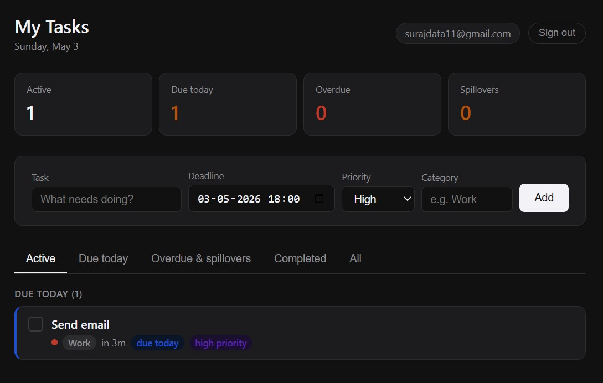
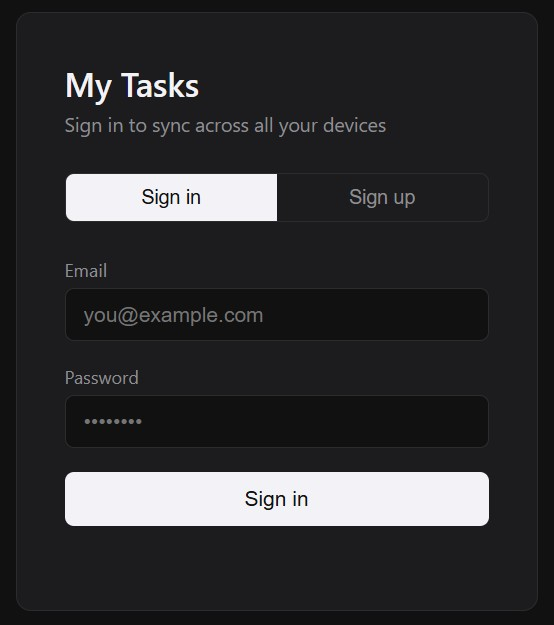

# Do It Today ✓

A minimal personal task manager with deadlines, reminders, and spillover tracking — synced across all your devices.

**Live app → [do-it-today-mu.vercel.app](https://do-it-today-mu.vercel.app)**

---

## Screenshots





---

## Features

- Add tasks with deadline, priority, and category
- Tasks grouped by: Overdue, Due today, Due soon, Upcoming
- **Spillover detection** — tasks that were created on one day but missed their deadline on a later day
- Stats bar: active, due today, overdue, spillovers
- Browser push notifications (1 hour before, 15 min before, at deadline)
- Real-time sync across all devices
- Dark mode

## Stack

- Plain HTML + JS (no framework, no build step)
- [Supabase](https://supabase.com) — auth + database + real-time sync
- [Vercel](https://vercel.com) — hosting

---

## Self-host your own copy

Everything runs on free tiers.

### 1. Supabase setup

1. Create a free project at [supabase.com](https://supabase.com)
2. Go to **SQL Editor → New query**, paste and run:

```sql
create table public.todos (
  id           uuid primary key default gen_random_uuid(),
  user_id      uuid not null references auth.users(id) on delete cascade,
  title        text not null,
  deadline     timestamptz,
  priority     text default 'med' check (priority in ('high', 'med', 'low')),
  category     text default '',
  done         boolean default false,
  completed_at timestamptz,
  created_at   timestamptz default now()
);

alter table public.todos enable row level security;

create policy "Users can view own todos"   on public.todos for select using (auth.uid() = user_id);
create policy "Users can insert own todos" on public.todos for insert with check (auth.uid() = user_id);
create policy "Users can update own todos" on public.todos for update using (auth.uid() = user_id);
create policy "Users can delete own todos" on public.todos for delete using (auth.uid() = user_id);

alter publication supabase_realtime add table public.todos;
```

3. Go to **Settings → API** and copy your **Project URL** and **anon public key**

### 2. Add credentials

Open `index.html` and replace:

```js
const SUPABASE_URL = 'YOUR_SUPABASE_URL';
const SUPABASE_ANON_KEY = 'YOUR_SUPABASE_ANON_KEY';
```

> The anon key is safe to expose — Supabase designed it to be public. Row Level Security ensures users can only access their own data.

### 3. Deploy to Vercel

1. Push `index.html` to a GitHub repo
2. Import the repo at [vercel.com](https://vercel.com) and click **Deploy**
3. Go to Supabase → **Authentication → URL Configuration** and set your Vercel URL as the Site URL

---

## License

MIT
